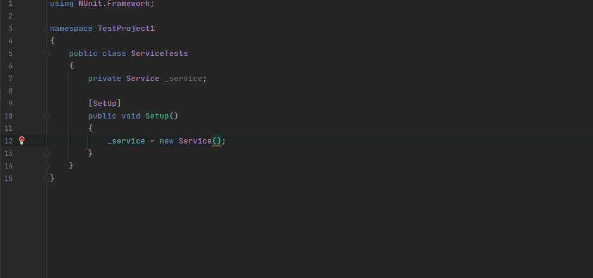
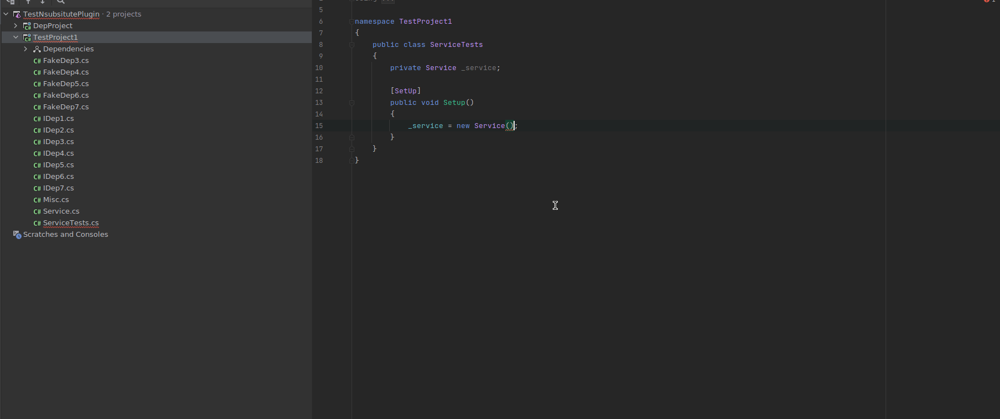
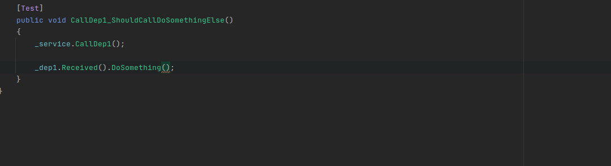

# NSubstituteComplete

A Rider / Resharper Plugin that provide quick fixes and smart autocomplete when using [NSubstitute](https://nsubstitute.github.io/)
[](https://plugins.jetbrains.com/plugin/15798-nsubstitutecomplete)
[](https://plugins.jetbrains.com/plugin/15801-nsubstitutecomplete)


## Build plugin

```shell
./gradlew :buildPlugin
```

## Functionality

### QuickFix: Fill with mocks



### Mock aliases

This quick fix support the "Mock Aliases" feature. This allows you to define (In the _Unit Testing Settings_ panel) a list of type that should not be mocked with `Substitute.For<>` but with an explicit type instead. This is useful for complex type that required a lot of mocking.

Here an [example](https://github.com/Socolin/NaheulbookBackend/blob/master/Naheulbook.Core.Tests.Unit/TestUtils/FakeUnitOfWorkFactory.cs) of such a type

Example of configuration
```c#
IDep1 => FakeDep1()
IDep2<T> = FakeDep2()
IDep3<T> = FakeDep3<T>
IDep4 = FakeDep4<T>
IGenericDep<IDep1> = FakeGenericDep1()
IGenericDep<IDep2> = FakeGenericDep2()
```

If the `Fake` class does not match `IDep` it will search into the members of the `Fake` class a matching member.

[](doc/images/MockedAliases.gif)


### Completion: Suggest Arg.Any / Arg.Is



## Notes

This plugin was inspired by [MoqComplete](https://github.com/Abc-Arbitrage/Abc.MoqComplete).
Thanks to all the people on the `#dotnet-pluginwriters` Slack channel for their help !

## Other plugins that may interest you

| Plugin |Rider | Resharper |
|-----|-----|------|
| RenameRelatedTests |[](https://plugins.jetbrains.com/plugin/15795-renamerelatedtests)|[](https://plugins.jetbrains.com/plugin/15800-renamerelatedtests)|
| AutocompleteTestStrings |[](https://plugins.jetbrains.com/plugin/15796-autocompleteteststrings)|[](https://plugins.jetbrains.com/plugin/15802-autocompleteteststrings)|
